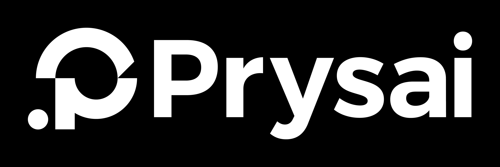
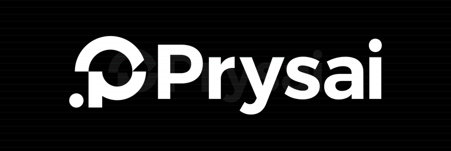
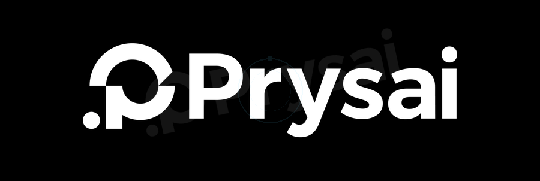

# Motiflux

Motiflux is an AI skill for turning a brand mark into an editable SVG scene and a
responsive, validated motion package. It treats logo animation as a constrained
design-and-verification problem: identity, topology, motion language, runtime
behavior, accessibility, and the canonical final state are all explicit.

Status: private development · Motiflux V1 · plugin release `1.0.0`

## What is included

- `.codex-plugin/plugin.json` — Codex plugin manifest and project metadata.
- `skills/motiflux/SKILL.md` — the core AI workflow and completion contract.
- `skills/motiflux/guides/motion-themes.md` — 13 theme routes with algorithm
  stacks, implementation controls, exclusions, and QA focus.
- `skills/motiflux/agents/openai.yaml` — UI metadata for skill discovery.
- `skills/motiflux/schemas/` — machine-readable contracts for plans, evidence,
  telemetry, and source observations.
- `skills/motiflux/catalog/themes.json` — the single machine-readable catalog
  for 13 routable motion themes.
- `skills/motiflux/tools/` — offline `measure`, `route`, `project`, `compare`,
  `audit`, `build`, and `validate` command seams.
- `examples/basic-mark/` — a deterministic end-to-end fixture.
- `showcase/` — a source-preserving 13-theme comparison grid, supplied Prysai
  asset, and generated PDF atlas.
- `docs/` and `tasks/` — architecture decisions and the active implementation
  plan.
- `scripts/validate_project.py` — dependency-free repository structure and
  content checks.

The skill keeps its working context focused. Project-level documentation and
validation stay outside the skill directory so they do not become accidental
instructions during an AI task.

## Design model

```text
source mark
    ↓
constraint graph → scene graph → motion graph → runtime package
    ↓                 ↓              ↓               ↓
evidence ledger ← geometry QA ← temporal QA ← accessibility QA
```

Theme selection changes choreography and implementation parameters; it must not
change identity constraints of the source mark. Public design systems are used
only as principle references, never as claims about private vendor algorithms or
copied assets.

## Showcase

The source-preserving atlas feeds the same supplied Prysai image into 13 real
browser animation players. The example request `artificial-intelligence logo
animation` routes to `AI-field`, where organized signals converge around the
same mark before it settles into the canonical image. Each card keeps the input
image beside a playable source -> reveal -> transform -> settle -> canonical
sequence. Algorithm stacks, beats, and QA focus remain secondary explanations
of the animation being shown.

[Open the interactive HTML grid](showcase/index.html) · [Download the PDF atlas](showcase/output/pdf/motiflux-theme-atlas.pdf)


<!-- GITHUB_GALLERY:START -->

## GitHub-native image → animation gallery

The same supplied Prysai source is shown on the left of every row. The right side is the actual portable GIF generated for that routed theme; keywords are the triggers an AI agent can use to select the route.

| # | Static source | Animated result | Theme / trigger keywords |
| --- | --- | --- | --- |
| 01 |  |  | **System-spatial**<br><code>system-spatial</code><br><code>system</code><br><code>product</code><br><code>saas</code><br><code>dashboard</code><br><code>enterprise</code><br><code>interface</code><br><code>structured</code><br><code>clear</code><br><code>technology</code> |
| 02 |  |  | **Premium-quiet**<br><code>premium-quiet</code><br><code>premium</code><br><code>luxury</code><br><code>fashion</code><br><code>beauty</code><br><code>editorial</code><br><code>quiet</code><br><code>elegant</code><br><code>minimal</code> |
| 03 |  |  | **Developer-open**<br><code>developer-open</code><br><code>developer</code><br><code>open source</code><br><code>opensource</code><br><code>api</code><br><code>cli</code><br><code>code</code><br><code>tooling</code><br><code>technical</code><br><code>precise</code> |
| 04 |  |  | **AI-field**<br><code>ai-field</code><br><code>ai</code><br><code>artificial intelligence</code><br><code>machine learning</code><br><code>ml</code><br><code>neural</code><br><code>data</code><br><code>model</code><br><code>generative</code><br><code>future</code><br><code>intelligent</code> |
| 05 |  |  | **Fintech-trust**<br><code>fintech-trust</code><br><code>fintech</code><br><code>banking</code><br><code>bank</code><br><code>payments</code><br><code>payment</code><br><code>trust</code><br><code>finance</code><br><code>institutional</code><br><code>reliable</code><br><code>secure finance</code> |
| 06 |  |  | **Security-shield**<br><code>security-shield</code><br><code>security</code><br><code>privacy</code><br><code>identity</code><br><code>authentication</code><br><code>auth</code><br><code>defense</code><br><code>shield</code><br><code>compliance</code><br><code>protection</code> |
| 07 |  |  | **Commerce-energy**<br><code>commerce-energy</code><br><code>commerce</code><br><code>retail</code><br><code>shopping</code><br><code>marketplace</code><br><code>consumer</code><br><code>sale</code><br><code>conversion</code><br><code>friendly</code> |
| 08 |  |  | **Automotive-precision**<br><code>automotive-precision</code><br><code>automotive</code><br><code>mobility</code><br><code>transport</code><br><code>engineering</code><br><code>performance</code><br><code>industrial</code><br><code>mechanical</code> |
| 09 |  |  | **Sports-impact**<br><code>sports-impact</code><br><code>sports</code><br><code>fitness</code><br><code>competition</code><br><code>speed</code><br><code>impact</code><br><code>bold</code><br><code>dynamic</code><br><code>athletics</code> |
| 10 |  |  | **Cinematic-title**<br><code>cinematic-title</code><br><code>cinematic</code><br><code>film</code><br><code>movie</code><br><code>title</code><br><code>trailer</code><br><code>story</code><br><code>dramatic</code><br><code>suspense</code> |
| 11 |  |  | **Nature-flow**<br><code>nature-flow</code><br><code>nature</code><br><code>organic</code><br><code>wellness</code><br><code>sustainable</code><br><code>water</code><br><code>wind</code><br><code>growth</code><br><code>calm</code><br><code>health</code> |
| 12 |  |  | **Gaming-world**<br><code>gaming-world</code><br><code>gaming</code><br><code>esports</code><br><code>fantasy</code><br><code>sci-fi</code><br><code>character</code><br><code>quest</code><br><code>arcade</code><br><code>playful</code> |
| 13 |  |  | **Accessibility-first**<br><code>accessibility-first</code><br><code>accessible</code><br><code>accessibility</code><br><code>reduced motion</code><br><code>calm</code><br><code>inclusive</code><br><code>low motion</code><br><code>keyboard</code><br><code>assistive</code> |

<!-- GITHUB_GALLERY:END -->

## Local validation

From the repository root:

```powershell
python scripts/validate_project.py
python H:\Codex\home\skills\.system\skill-creator\scripts\quick_validate.py skills\motiflux
python H:\Codex\home\skills\.system\plugin-creator\scripts\validate_plugin.py .
python -m unittest discover -s tests -v
```

The two paths into `H:\Codex\home` are local development helpers. The first
command is the repository's portable check and is the one used by GitHub Actions.

## Tool pipeline

```powershell
python skills\motiflux\tools\motiflux.py measure examples\basic-mark\mark.svg --output work\source-analysis.json
python skills\motiflux\tools\motiflux.py validate source-analysis work\source-analysis.json
python skills\motiflux\tools\motiflux.py compare examples\basic-mark\mark.svg examples\basic-mark\mark.svg
python skills\motiflux\tools\motiflux.py audit examples\basic-mark\telemetry.json --duration-ms 1200
python skills\motiflux\tools\motiflux.py build examples\basic-mark\mark.svg examples\basic-mark\motion-plan.yaml work\basic-package
python skills\motiflux\tools\motiflux.py route "AI security startup"
python skills\motiflux\tools\motiflux.py project examples\basic-mark\mark.svg "AI logo animation" work\project
python skills\motiflux\tools\motiflux.py validate project work\project\project.json
python showcase\generate_showcase.py
```

The project command runs `analyze -> route -> plan -> reconstruct -> compile ->
verify -> package` and writes a traceable `project.json`. SVG input can compile
through the deterministic fixture; raster input remains an honest `candidate`
until a real raster-to-vector adapter is available.

The output is deliberately evidence-preserving. A valid semantic SVG comparison
does not claim browser pixels, raster contours, or accessibility-tree proof.
Those remain explicit `not_run` items until the corresponding adapter runs.

## Development boundary

This repository is intentionally private while Motiflux V1 is being developed.
No public release, GitHub Pages deployment, or production runtime is implied by
the repository itself. A consuming project supplies the source mark and produces
the output package described by the skill contract.

## Showcase boundary

The `showcase/` atlas is a separate demonstration surface inspired by the
source-to-output comparison pattern used by public logo-motion projects. It
uses one supplied Prysai raster source across 13 routed themes. Its HTML output
contains dependency-free `requestAnimationFrame` players with per-card play,
pause, replay, timeline, reduced-motion, and hidden-page behavior. Its PDF is a
static four-frame storyboard of those playable sequences, with algorithm notes
kept as context. These materials do not claim private vendor algorithms,
copied assets, or generic-package browser validation.
