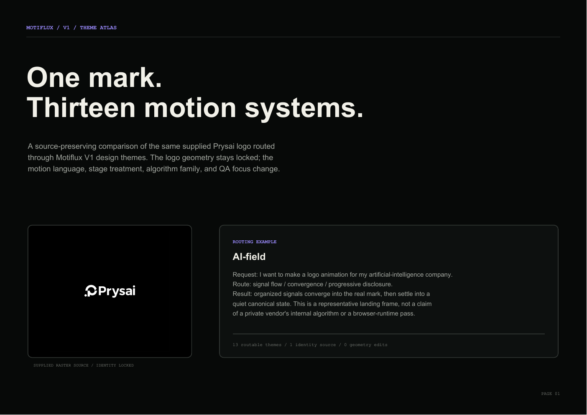

# Motiflux

Motiflux is an AI skill for turning a brand mark into an editable SVG scene and a
responsive, validated motion package. It treats logo animation as a constrained
design-and-verification problem: identity, topology, motion language, runtime
behavior, accessibility, and the canonical final state are all explicit.

Status: private development · Motiflux V1 · plugin release `1.0.0`

## What is included

- `.codex-plugin/plugin.json` — Codex plugin manifest and project metadata.
- `skills/motiflux/SKILL.md` — the core AI workflow and completion contract.
- `skills/motiflux/guides/motion-themes.md` — 13 theme routes with algorithm
  stacks, implementation controls, exclusions, and QA focus.
- `skills/motiflux/agents/openai.yaml` — UI metadata for skill discovery.
- `skills/motiflux/schemas/` — machine-readable contracts for plans, evidence,
  telemetry, and source observations.
- `skills/motiflux/tools/` — offline `measure`, `compare`, `audit`, `build`, and
  `validate` command seams.
- `examples/basic-mark/` — a deterministic end-to-end fixture.
- `showcase/` — a source-preserving 13-theme comparison grid, supplied Prysai
  asset, and generated PDF atlas.
- `docs/` and `tasks/` — architecture decisions and the active implementation
  plan.
- `scripts/validate_project.py` — dependency-free repository structure and
  content checks.

The skill keeps its working context focused. Project-level documentation and
validation stay outside the skill directory so they do not become accidental
instructions during an AI task.

## Design model

```text
source mark
    ↓
constraint graph → scene graph → motion graph → runtime package
    ↓                 ↓              ↓               ↓
evidence ledger ← geometry QA ← temporal QA ← accessibility QA
```

Theme selection changes choreography and implementation parameters; it must not
change identity constraints of the source mark. Public design systems are used
only as principle references, never as claims about private vendor algorithms or
copied assets.

## Showcase

The source-preserving atlas applies the same supplied Prysai logo to 13 motion
themes. The example request `artificial-intelligence logo animation` routes to
`AI-field`, where organized signals converge into the real mark before it
settles. Each card shows the source, representative output frame, algorithm
stack, motion beats, and QA focus.

[Open the interactive HTML grid](showcase/index.html) · [Download the PDF atlas](showcase/output/pdf/motiflux-theme-atlas.pdf)



## Local validation

From the repository root:

```powershell
python scripts/validate_project.py
python H:\Codex\home\skills\.system\skill-creator\scripts\quick_validate.py skills\motiflux
python H:\Codex\home\skills\.system\plugin-creator\scripts\validate_plugin.py .
python -m unittest discover -s tests -v
```

The two paths into `H:\Codex\home` are local development helpers. The first
command is the repository's portable check and is the one used by GitHub Actions.

## Tool pipeline

```powershell
python skills\motiflux\tools\motiflux.py measure examples\basic-mark\mark.svg --output work\source-analysis.json
python skills\motiflux\tools\motiflux.py validate source-analysis work\source-analysis.json
python skills\motiflux\tools\motiflux.py compare examples\basic-mark\mark.svg examples\basic-mark\mark.svg
python skills\motiflux\tools\motiflux.py audit examples\basic-mark\telemetry.json --duration-ms 1200
python skills\motiflux\tools\motiflux.py build examples\basic-mark\mark.svg examples\basic-mark\motion-plan.yaml work\basic-package
python skills\motiflux\tools\motiflux.py route "AI security startup"
python showcase\generate_showcase.py
```

The output is deliberately evidence-preserving. A valid semantic SVG comparison
does not claim browser pixels, raster contours, or accessibility-tree proof.
Those remain explicit `not_run` items until the corresponding adapter runs.

## Development boundary

This repository is intentionally private while Motiflux V1 is being developed.
No public release, GitHub Pages deployment, or production runtime is implied by
the repository itself. A consuming project supplies the source mark and produces
the output package described by the skill contract.

## Showcase boundary

The `showcase/` atlas is a separate demonstration surface inspired by the
source-to-output comparison pattern used by public logo-motion projects. It
uses one supplied Prysai raster source across 13 routed themes. Its HTML output
contains representative, deterministic CSS motion studies; its PDF contains
static landing frames and algorithm annotations. These materials do not claim
private vendor algorithms, copied assets, or browser-runtime validation.
